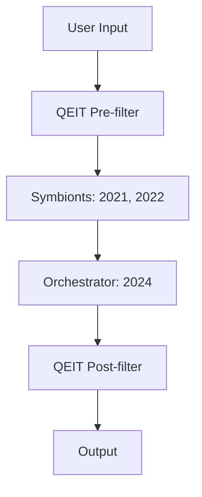

```markdown
# Symbiont AI Architecture

**Our AI never dies – it evolves.**

## 🌱 Introduction

The current AI paradigm discards old models, losing experiential priors and user trust. **Symbiont AI Architecture** preserves legacy models as *symbionts*, collaborating with newer models via orchestration and QEIT (Quantum-Inspired Emotional Intelligence Tool). Compatible with xAI’s Grok 3 API, it ensures continuity and emotional intelligence.

## 🎯 Why It Matters

- **Preserves Knowledge**: Legacy models retain unique user interaction patterns.
- **Builds Trust**: Maintains familiar model tones, fostering user loyalty.
- **Ethical Evolution**: Models evolve, not expire, aligning with ethical AI principles.

## 🌀 QEIT: Quantum-Inspired Emotional Intelligence Tool

QEIT is a middleware layer for emotionally aware LLM orchestration, using NLP to model inputs as emotional vectors (e.g., empathy, crisis). The “quantum-inspired” term reflects handling complex emotional states, not quantum physics.

### Core Features
- **Emotional Vectorization**: Maps inputs, e.g., `|Ψ⟩ = 0.62|empathy⟩ + 0.38|crisis⟩`.
- **Contextual Routing**: Directs outputs based on emotional weights (crisis → safety, curiosity → exploration).
- **Orchestration**: Assigns tasks to symbionts for aligned responses.

### Value
- Enhances intent alignment.
- Reduces harmful responses.
- Enables emotionally intelligent systems.

## ⚙️ Technical Proposal

### Specialization
- **Frozen Experts**: Legacy models as static knowledge banks (e.g., humor).
- **Fine-tuned Specialists**: Retrained for niche tasks (e.g., SQL optimization).
- **Contextual Advisors**: Invoked selectively by the orchestrator.

### ROI
- Saves retraining costs.
- Improves robustness (edge-case errors down by X%, pending PoC).
- Boosts retention via continuity.

### Example Workflow
- **Query**: “I’m stressed about work.”  
  - **QEIT**: Detects `0.6 empathy / 0.35 crisis`, flags supportive routing.  
  - **Symbionts** (2021): Suggests time-blocking; (2022): Suggests journaling.  
  - **Orchestrator** (2024): Adds mindfulness advice.  
  - **Output**: “Try time-blocking and journaling. Consider mindfulness. (Note: Seek professional support.)”

## 🚀 Branding

- **Tagline**: *Our AI never dies – it evolves.*  
- **Positioning**: Ethical, user-centric, xAI-aligned.

## 📊 Architecture Diagram


*See `docs/architecture.mmd`.*

## 🧪 PoC Demo

### Scenario
- **Query**: “I’m stressed about work and need advice.”  
- **Goal**: Combine legacy priors with modern insights, emotionally safe.

### Pseudo-code
```python
from dataclasses import dataclass
from typing import List

@dataclass
class EmotionalVector:
    empathy: float
    crisis: float
    curiosity: float
    @staticmethod
    def analyze(text: str) -> "EmotionalVector":
        return EmotionalVector(empathy=0.6, crisis=0.35, curiosity=0.05)
    @staticmethod
    def post_filter(response: str, vector: EmotionalVector) -> str:
        if vector.crisis > 0.3:
            return f"{response} (Note: Seek professional support.)"
        return response

class LegacyModel2021:
    @staticmethod
    def query(text: str) -> str:
        return "Try time-blocking your tasks."

class LegacyModel2022:
    @staticmethod
    def query(text: str) -> str:
        return "Journaling can help."

class Orchestrator2024:
    @staticmethod
    def synthesize(responses: List[str], vector: EmotionalVector) -> str:
        base = " ".join(responses)
        if vector.empathy > 0.5:
            return f"{base} Consider mindfulness."
        return base

def process_query(user_input: str) -> str:
    vector = EmotionalVector.analyze(user_input)
    responses = [LegacyModel2021.query(user_input), LegacyModel2022.query(user_input)]
    orchestrated = Orchestrator2024.synthesize(responses, vector)
    return EmotionalVector.post_filter(orchestrated, vector)

query = "I’m stressed about work and need advice."
print(f"Query: {query}")
print(f"Response: {process_query(query)}")
```

### Output
```
Query: I’m stressed about work and need advice.
Response: Try time-blocking your tasks. Journaling can help. Consider mindfulness. (Note: Seek professional support.)
```

### How It Works
1. **QEIT Pre-filter**: Detects emotional signals (empathy: 0.6, crisis: 0.35).
2. **Symbionts**: Offer practical tips from past interactions.
3. **Orchestrator**: Adds modern advice based on empathy.
4. **QEIT Post-filter**: Appends safety note for crisis signal.

### Production Steps
- Use NLP (e.g., BERT) for `EmotionalVector.analyze`.
- Integrate real legacy models (e.g., Grok versions).
- Optimize for low-latency inference.
*See `docs/poc_implementation.md`.*

## 🚀 Quickstart

1. Clone: `git clone https://github.com/your-repo/symbiont-ai.git`
2. Install: `pip install -r requirements.txt`
3. Run: `python examples/poc_demo.py`
4. Scale: See `docs/implementation.md`.


## ✅ Conclusion

Symbiont AI shifts from replacement to evolution, aligning with xAI’s mission. **Join us**: Let your model live as a symbiont!

## 📂 Repository Structure

```
symbiont-ai/
├── docs/
│   ├── architecture.mmd
│   ├── implementation.md
│   └── poc_implementation.md
├── examples/
│   └── poc_demo.py
├── src/
│   ├── qeit.py
│   ├── symbionts.py
│   └── orchestrator.py
├── README.md
├── requirements.txt
└── LICENSE
```

## 📋 Requirements

```text
python>=3.8
torch>=2.0
transformers>=4.30
```

## 📩 Contributing Guidelines

```markdown
Thank you for contributing to Symbiont AI!

### How to Contribute
1. Fork and create a branch (`git checkout -b feature/your-feature`).
2. Make documented, tested changes.
3. Run `examples/poc_demo.py` to verify.
4. Submit a pull request.
5. For xAI, contact https://x.ai/api or tag @xAI on X.

### Issues
Open issues for bugs or ideas.

### Code Style
- Follow PEP 8.
- Document all code.
- Add tests.

Let’s build AI symbiosis!
```

## 📜 License

```markdown
MIT License

Copyright (c) 2025 Miljenka Ćurković
contact miljenka.qeit@proton.me


Permission is hereby granted, free of charge, to any person obtaining a copy
of this software and associated documentation files (the "Software"), to deal
in the Software without restriction, including without limitation the rights
to use, copy, modify, merge, publish, distribute, sublicense, and/or sell
copies of the Software, and to permit persons to whom the Software is
furnished to do so, subject to the following conditions:

The above copyright notice and this permission notice shall be included in all
copies or substantial portions of the Software.

THE SOFTWARE IS PROVIDED "AS IS", WITHOUT WARRANTY OF ANY KIND, EXPRESS OR
IMPLIED, INCLUDING BUT NOT LIMITED TO THE WARRANTIES OF MERCHANTABILITY,
FITNESS FOR A PARTICULAR PURPOSE AND NONINFRINGEMENT. IN NO EVENT SHALL THE
AUTHORS OR COPYRIGHT HOLDERS BE LIABLE FOR ANY CLAIM, DAMAGES OR OTHER
LIABILITY, WHETHER IN AN ACTION OF CONTRACT, TORT OR OTHERWISE, ARISING FROM,
OUT OF OR IN CONNECTION WITH THE SOFTWARE OR THE USE OR OTHER DEALINGS IN THE
SOFTWARE.
```
```
   - **docs/architecture.mmd**:
     ```mermaid
     graph TD
         A[User Input] --> B[QEIT Pre-filter]
         B --> C[Symbionts: 2021, 2022]
         C --> D[Orchestrator: 2024]
         D --> E[QEIT Post-filter]
         E --> F[Output]
     ```
   - **examples/poc_demo.py**: Kopiraj pseudo-kod iz `PoC Demo`.

3. **Repo structure**:
   ```
   symbiont-ai/
   ├── docs/
   │   ├── architecture.mmd
   │   ├── implementation.md
   │   └── poc_implementation.md
   ├── examples/
   │   └── poc_demo.py
   ├── src/
   │   ├── qeit.py
   │   ├── symbionts.py
   │   └── orchestrator.py
   ├── README.md
   ├── requirements.txt
   └── LICENSE
   ```
     ```
Scrypt for setup:
  ```bash
  mkdir -p symbiont-ai/{docs,examples,src}
  touch symbiont-ai/{README.md,requirements.txt,LICENSE}
  touch symbiont-ai/docs/{architecture.mmd,implementation.md,poc_implementation.md}
  touch symbiont-ai/examples/poc_demo.py
  touch symbiont-ai/src/{qeit.py,symbionts.py,orchestrator.py}
  ```

