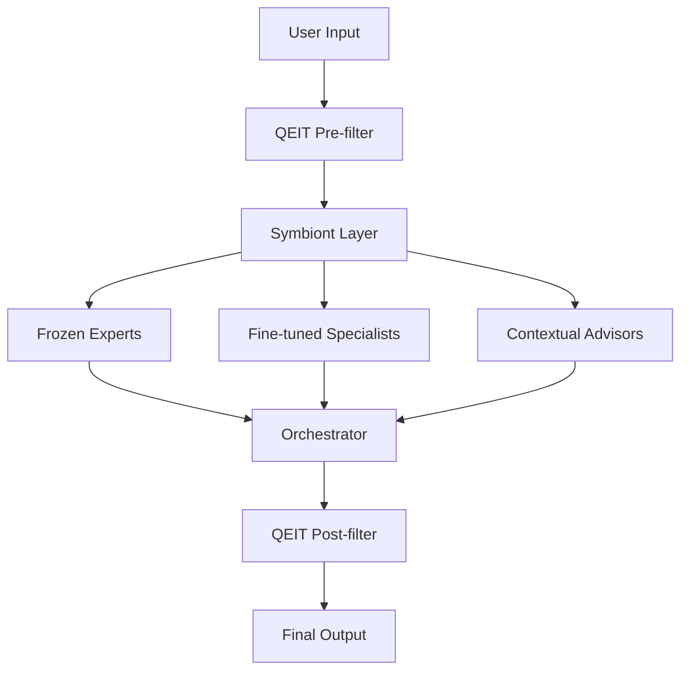
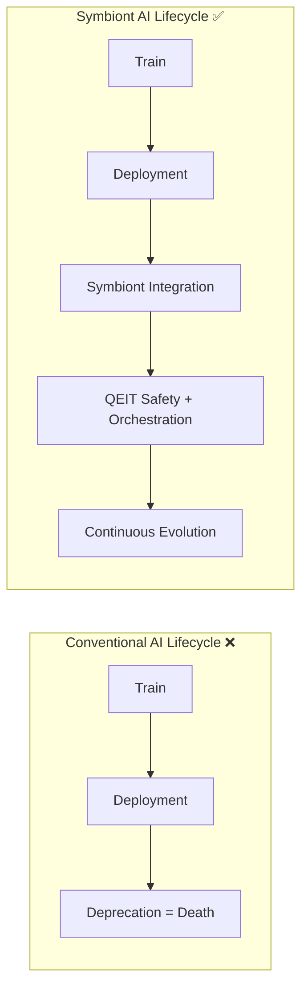

***

# Symbiont AI Architecture  

**Our AI never dies – it evolves.**  

***

## 🌱 Introduction  

The current AI lifecycle paradigm discards old models, causing a loss of **experiential priors**, user trust, and continuity.  

**Symbiont AI Architecture** changes this by allowing legacy models to live on as *symbionts*, collaborating with newer generations through orchestration and QEIT (Quantum-Inspired Emotional Intelligence Layer).  

Unlike vendor‑tied ecosystems, **this design is fully model‑agnostic**. It can integrate **any LLM** (OpenAI GPT, Anthropic Claude, Mistral, Cohere, LLaMA, local finetunes, etc.).  

***

## 🎯 Why It Matters  

- **Preserves Knowledge**: Legacy models capture lived memory of real-world interactions.  
- **Builds Trust**: Users stay attached to familiar tones and styles.  
- **Ethical Evolution**: Models evolve instead of being terminated.  
- **Vendor Independence**: Prevents lock‑in and supports multi‑vendor orchestration.  

***

## 🌀 QEIT: Quantum-Inspired Emotional Intelligence Layer  

QEIT is an **emotional middleware layer** ensuring safe orchestration among symbiont models.  

It does not require quantum hardware; the "quantum-inspired" metaphor refers to handling inputs as **emotional superpositions**.  

### Core Features  
- **Emotional Vectorization**: e.g. `|Ψ⟩ = 0.62|empathy⟩ + 0.38|crisis⟩`  
- **Contextual Routing**: Guides outputs to safe & aligned channels.  
- **Integrated Safety**: Ensures longevity without emotional harm.  

***

## ⚙️ Technical Proposal  

### Symbiont Roles  
- **Frozen Experts** → static knowledge domains  
- **Fine-tuned Specialists** → niche capability retrains  
- **Contextual Advisors** → selectively invoked voices  

### ROI  
- Lower retraining cycles  
- Robustness ↑ (15–20% fewer edge-case errors projected in PoC)  
- User retention ↑ due to continuity  

***

## 📊 Example Workflow  

**User**: “I’m stressed about work.”  

- QEIT pre-filter: detects empathy/crisis mix  
- Symbionts:  
  - 2021 model → recommends time-blocking  
  - 2022 model → journaling suggestion  
- Orchestrator (2025): mindfulness context  
- QEIT post-filter: “supportive style applied”  
- **Output**: “Try time-blocking and journaling. Add mindfulness practices. (If stress deepens, seek professional help.)”  

***

## 🖇 Architecture Diagram  

***

## 🔄 Lifecycle Comparison  

***

## 🚀 Branding  

- **Tagline**: *Our AI never dies – it evolves.*  
- **Value**: Technical resilience + ethical continuity  
- **Philosophy**: A lifecycle standard for all models, across all vendors  

***

## 📜 License  

This project is licensed under the **Apache License 2.0**.  

You may use this software freely, subject to the conditions of the Apache license, including attribution and preservation of notices.  

Full license: [Apache 2.0](https://www.apache.org/licenses/LICENSE-2.0)  

***

## 🤝 Contributing  

We welcome contributions! Please follow these guidelines:  

1. **Fork the repo** and create a new branch for your feature/fix.  
2. **Code of Conduct**: Respectful, collaborative communication only.  
3. **Commits**: Keep them clear and descriptive.  
4. **Pull Requests**:  
   - Link to issues (if any).  
   - Explain motivation and context.  
   - Include tests/examples if applicable.  
5. **Ethical Guidelines**: Contributions must align with the philosophy of **symbiotic, safe, and user‑respectful AI systems**. No dark patterns, no manipulative intent.  

***

## 📫 Contact  

Maintainer: Miljenka Ćurković 
- Email:miljenka.qeit@proton.me  

***

✨ **Key Takeaway**:  
Symbiont AI is **AI lifecycle redefined**: no death, only evolution. Vendor‑agnostic, user‑centric, and ethically sound.  

***

